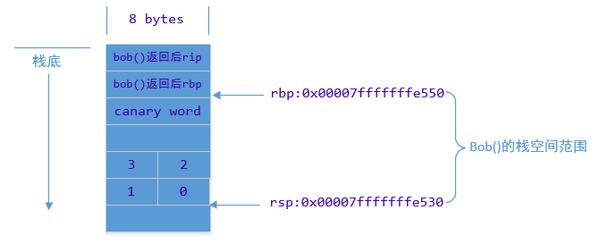
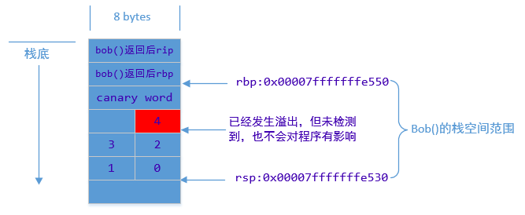

## **Gcc 安全编译参数**
### **A. Linux或Android平台（后台）操作系统下，所有符合安全编译选项落地范围的产品，必须落地的选项有：ASLR（级别为2）**
- **问题背景**
    ```sh
    # 目的：可以通过猜测，运行程序的地址进行破解
    # 做法：支持程序随机加载至指定位置
    # 方案1：操作系统ASLR功能选项。【局限】只能对stack,heap,librarise进行随机化
    # 方案2：ASLR + PIE 【功能】在ASLR 支持对代码段，全局区地址进行随机化。
    #           
    ```

- **ASLR的是操作系统的功能选项** 作用于executable（ELF）装入内存运行时，因而只能随机化stack、heap、libraries的基址。
- **ASLR有0/1/2三种级别** 0：ASLR未开启，1：随机化stack、libraries，2：还会随机化heap。
- **ASLR与PIE，PIC的关系**
    1. ASLR 是操作系统的设置项。
    2. PIC是编译动态库随机化地址的设置项。PIE是编译可以执行程序时随机随机化地址的设置项。
    3. PIE 编译处理的可执行程序像是一个特殊的SO，支持随机加载。
    4. PIE 赋予了可执行程序随机加载的能力；ASLR 操作系统设置项决定了是否使用该能力。
    5. ASLR 与 PIE 配合使用
        ```sh
        # ASLR[0] + PIE : 不进行随机化
        # ASLR[1] + PIE : Stack, Heap, libraries, executable-base [被动随机+受heap随机化的影响][heap和executable-base是连在一起的]
        # ASLR[2] + PIE : Stack, Heap, libraries, executable-base 随机化
        ```

- **相关操作**
    1. 设置 ASLR： echo 1 > /proc/sys/kernel/randomize_va_space

### **B. 栈保护(-fstack-protector-all/-fstack-protector-strong)**
- **程序压栈汇编代码是什么？**
    ```C
    // 在call执行后，在被调用函数最开始进行的。目的是保存上一个函数的栈信息，用于返回执行。
    push %rbp       /* 将当前函数栈底指针入栈 */
    mov %rsp, %rbp，/* 然后将栈顶指针赋给栈底指针 */ 
    ```
- **栈保护实现简介**
    1. gcc堆栈保护技术基本都是通过canaries探测来实现的
    2. Canaries探测要检测对函数栈的破坏，需要修改函数栈的组织， 要在缓冲区和控制信息(压在栈中的函数返回后的RBP和RIP)中间插一个canary word
    3. 当缓冲区被破坏的时候，canary word会在函数栈控制信息被破坏之前被破坏
    4. 通过检测canary word的值是否被修改，就可以判断出是否发生溢出攻击。

- **为什么要开启栈对齐，它的编译选项是？**
    1. 栈保护功能需要插入8bytes的数据。不同指令集决定了硬件寄存器的位数实现，决定了对齐的方式。
    2. 编译选项：-mpreferred-stack-boundary=3。 3表示2的3次方。即：8位对齐。 
    3. 栈保护开启导致栈对齐的历史问题
        ```sh
        #   Intel在Pentium III推出了SSE指令集，SSE 加入新的 8 个128Bit(16bytes)寄存器（XMM0～XMM7）。
        #   最初的时候，这些寄存器智能用来做单精度浮点数计算
        #   自从SSE2开始，这些寄存器可以被用来计算任何基本数据类型的数据了。
        #   往XMM0～XMM7里存放数据，是以16字节为单位，所以呢 内存变量首地址必须要对齐16字节，
        #   否则会引起CPU异常，导致指令执行失败。所以这就是gcc默认采用16bytes进行栈对齐的原因。
        # 
        # 在SSE扩展被关闭时，-mpreferred-stack-boundary参数值是可以修改的。但是，但是，但是，当该选项值被修改后，编译链接16bytes栈对齐的库时，会导致错误。
        ```

    4. **重点/易错点**
        ```sh
        # 在SSE扩展被关闭时，-mpreferred-stack-boundary参数值是可以修改的。但是，当该选项值被修改后，编译链接16bytes栈对齐的库时，会导致错误。
        ```

- **开启栈保护将导致什么问题？**
    1. **问题：链接第三方库时链接错误**
    2. **原因分析**
        ```sh
        # 直接原因：对齐问题导致的不兼容
        # 历史原因：指令集决定了gcc的编译方式
        # 根本原因：栈保护功能需要插入8bytes的数据，造成对齐问题
        ```
    
- **栈保护gcc演变历史**
> **GCC 4.1 堆栈保护才被加入，所采用的堆栈保护实现Stack-smashing Protection（SSP，又称 ProPolice）。到目前GCC6.2中与堆栈保护有关的编译选项，有如下几个**
1. -fstack-protector: 启用堆栈保护，不过只为局部变量中含有 char 数组的函数插入保护代码。
2. -fstack-protector-all:  启用堆栈保护，为所有函数插入保护代码。
3. -fstack-protector-strong(GCC4.9引入)
    ```sh
    # 包含和-fstack-protector一样的功能
    # 包含额外的保护：函数内部有数组定义，以及有对局部栈上的地址引用。
    ```
4. -fstack-protector-explicit： 和-fstack-protector的区别是：只对有stack_protect属性的函数进行保
5. -fno-stack-protector： 禁用堆栈保护。

- **栈保护图解**  
  
  

### **C. 堆栈不可执行（-Wl,-z,noexecstack）**
- **堆栈不可执行历史背景**
    1. GNU/Linux系统级攻防在历史上曾经停留在用户空间很长的时间，经历了NX/COOKIE/PIE/ASLR/RELRO的进化后， “researcher”们已经无法通过用户空间触及到“上帝宝藏”(-_root_-)
    2. sgrakkyu和twzi在Phrack Issue 64中的Attacking the Core标志着这个领域正式进入了内核层面的对抗
    3. 10年过去了，在新的时代性背景下（Android/IoT/TEE），人们意识到安全应该是一个整体（again?WTH），而单纯依赖于内核层面的攻防无法解决很多老问题
    4. 传统的mitigation技术再次在某些场景化的方案中受到重视，NX（armv6中是XN）是其中之一。
    5. 这篇文档详细的分析了GCC/ld/kernel三个层面的NX的工作路线图。

- **问题描述**
    1. 在计算机安全领域一个很经典的话题就是缓冲区溢出(Buffer Overflow)  
    2. 缓冲区溢出一般时 候伴随着攻击者的篡改堆栈里保存的返回地址,然后执行注入到stack中的shellcode  
    3. 攻击者可以发挥想象力仔细编写shellcode进行下一步的攻击,直到完全控制了计算机  

- **问题处理方略**
    1. compiler-assembler-linker(这里表示一个生成 binary的过程: 编译->汇编->链接器)里
        ```sh
        # 在compiler-assembler-linker里的实 现基本上的纯粹的软件实现
        # 结果是在elf的一个stack的section里置位不可以执行.但是捕 获违反stack不可执行这个问题是在kernel里.

        # 实现简介：
        # 当调用gcc -z execstack test.c时,gcc将参数打包处理传给ld, 
        # 由于参数的影响,ld会在生成的ELF文件stack对应的program header里置位p_flags的PF_X值。
        # 当ELF文件执行时,由于RAM需要分配就会触发page fault
        # 然后处理do_page_fault()函数里 调用access_error()以捕获到stack的执行权限错误.
        #
        ```
    2. kernel里
        ```sh
        # 在kernel里的实现,随着处理器在(页模式)paging处理过程中涉及到功能寄存器中引入 No-eXecute的配置位
        # 所以实际上kernel在实现NX的时候是在相关的寄存器里置NX的位,在 CPU操作的时候由硬件来做是否可以执行的检查.
        #
        # 实现简介：
        # 要想在MMU层面使用NX,首先需要检测 CPUID.80000001H:EDX.NX [bit 20]是否为1,如果是1进行IA32_EFER.NXE的置位使能,然后按 照需在PAE/PTE里使能第63位(XD).
        # 【需查看相关的文档和数据结构：Intel® 64 and IA-32 Architectures Developer’s Manual】
        ```

### **相关链接**
[ASLR](https://www.cnblogs.com/rec0rd/p/7646857.html)
[栈保护](https://www.cnblogs.com/mysky007/p/11105307.html)
[NX-No-eXecute](https://hardenedlinux.github.io/system-security/2016/06/01/NX-analysis.html)


